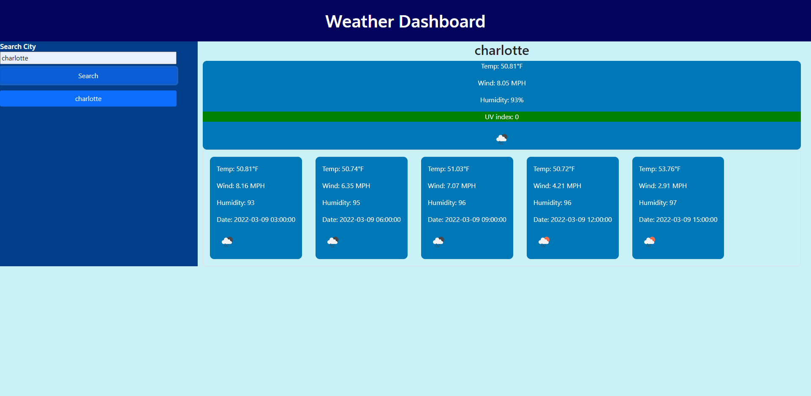

# weather-app

## Project Description
In this project we were taksed with creating a weather application. When the user wants to search for a city then the current, and future results for that city are displayed and the city is then added into a search history. This is done by submitting several API requests to get both the current weather and display it and to fetch the 5 day forcast and display it as well. The next task was showing the cities name, the date, an icon representation of the weather conditions, the temperature, humidity, wind speed, and UV index. This is done by drilling through the json data, getting any requested data and appending them to the page. The next piece of the puzzle was making the UV display a certain color based on the UV index. This was done by creating an if statement to see what the current UV index is and creating a colored button based off that. The 5 day forcast needed to do a similar thing to the current weather where it displayed some info. It does this in much the same way the current forcast does. The last task was to be able to click on a city in the search history and have that city searched again. This was done by creating an on click on these dynamically created buttons that ran the program again inputting their inner text as the city value. 

## Project Link
The project site can be found [here](https://choyle-01.github.io/weather-app/)

## Github Repository
The Github repository can be found [here](https://github.com/choyle-01/weather-app)

## Visuals

